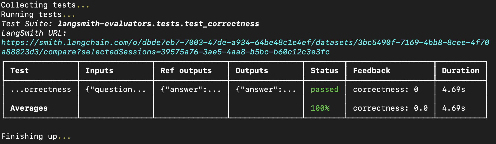
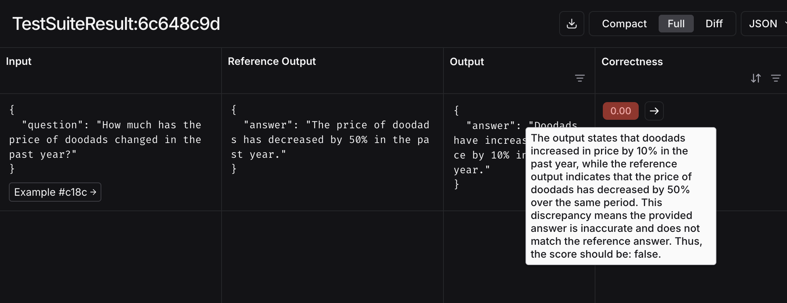

# 🦜⚖️ LangMetrics

Much like unit tests in traditional software, evals are a hugely important part of bringing LLM applications to production.
The goal of this package is to help provide a starting point for you to write evals for your LLM applications, from which
you can write more custom evals specific to your application.

To learn more about how to write more custom evals, please check out this [documentation](https://docs.smith.langchain.com/evaluation/how_to_guides/custom_evaluator).

## Quickstart

To get started, install `langmetrics`:

```bash
pip install langmetrics
```

This quickstart will use an evaluator powered by OpenAI's `o3-mini` model to judge your results, so you'll need to set your OpenAI API key as an environment variable:

```bash
export OPENAI_API_KEY="your_openai_api_key"
```

Once you've done this, you can run your first eval:

```python
from langmetrics.evaluators.llm import create_llm_as_judge
from langmetrics.evaluators.prompts import CORRECTNESS_PROMPT

correctness_evaluator = create_llm_as_judge(
    prompt=CORRECTNESS_PROMPT,
)

inputs = "How much has the price of doodads changed in the past year?"
# These are fake outputs, in reality you would run your LLM-based system to get real outputs
outputs = "Doodads have increased in price by 10% in the past year."
reference_outputs = "The price of doodads has decreased by 50% in the past year."
# When calling an LLM-as-judge evaluator, parameters are formatted directly into the prompt
eval_result = correctness_evaluator(
  inputs=inputs,
  outputs=outputs,
  reference_outputs=reference_outputs
)

print(eval_result)
```

```
{
    'key': 'score',
    'score': False,
    'comment': 'The provided answer stated that doodads increased in price by 10%, which conflicts with the reference output...'
}
```

Some things to note:

- All `langmetrics` evaluators return results in the format of the example above, or a list of results in some cases.
- `CORRECTNESS_PROMPT` is just an f-string, so you can and should edit it as needed for your specific use case and evaluation criteria.
  - `prompt` can also be a [LangChain prompt template](https://python.langchain.com/docs/concepts/prompt_templates/) (and can be pulled from the [LangSmith prompt hub](https://smith.langchain.com/hub/)) or a function that returns a list of formatted OpenAI messages. For more information, see [this section](#customizing-prompts).
- By default, evaluators will score results as simply `True` or `False`. For more granular scoring, see [this section](#customizing-output-scores).
- The default model used for LLM-as-judge evaluators is OpenAI's `o3-mini`. If you would like to use a different model, see [this section](#customizing-the-model).

### Integrating with LangSmith

For tracking experiments over time, you can log results to [LangSmith](https://smith.langchain.com/).

First, follow [these instructions](https://docs.smith.langchain.com/evaluation/how_to_guides/pytest) to set up LangSmith's pytest runner,
setting appropriate environment variables:

```bash
export LANGSMITH_API_KEY="your_langsmith_api_key"
export LANGSMITH_TRACING="true"
```

Then, set up a file named `test_correctness.py` with the following contents:

```python
import pytest

from langsmith import testing as t

from langmetrics.evaluators.llm import create_llm_as_judge
from langmetrics.evaluators.prompts import CORRECTNESS_PROMPT

correctness_evaluator = create_llm_as_judge(
    prompt=CORRECTNESS_PROMPT,
    feedback_key="correctness",
)

@pytest.mark.langsmith
def test_correctness():
    inputs = "How much has the price of doodads changed in the past year?"
    outputs = "Doodads have increased in price by 10% in the past year."
    reference_outputs = "The price of doodads has decreased by 50% in the past year."
    t.log_inputs({"question": inputs})
    t.log_outputs({"answer": outputs})
    t.log_reference_outputs({"answer": reference_outputs})

    correctness_evaluator(
        inputs=inputs,
        outputs=outputs,
        reference_outputs=reference_outputs
    )
```

Note that when creating the evaluator, we've added a `feedback_key` parameter. This will be used to name the feedback in LangSmith.

Now, run the eval with pytest:

```bash
pytest test_correctness.py --langsmith-output
```

Feedback from the prebuilt evaluator will be automatically logged in LangSmith as a table of results like this in your terminal:



And you should also see the results in the experiment view in LangSmith:



## Table of Contents

- [Installation](#installation)
- [Evaluators](#evaluators)
  - [LLM-as-Judge](#llm-as-judge)
  - [Agent Trajectory](#agent-trajectory)
  - [Other](#other)
    - [Exact Match](#exact-match)
    - [Levenshtein Distance](#levenshtein-distance)
    - [Embedding Similarity](#embedding-similarity)
- [LangSmith Integration](#langsmith-integration)
  - [Pytest](#pytest)
  - [Evaluate](#evaluate)

## Installation

You can install `langmetrics` like this:

```bash
pip install langmetrics
```

For LLM-as-judge evaluators, you will also need an LLM client. By default, `langmetrics` will use [LangChain chat model integrations](https://python.langchain.com/docs/integrations/chat/) and comes with `langchain_openai` installed by default. However, if you prefer, you may use the OpenAI client directly:

```bash
pip install openai
```

It is also helpful to be familiar with some [evaluation concepts](https://docs.smith.langchain.com/evaluation/concepts) and
LangSmith's pytest integration for running evals, which is documented [here](https://docs.smith.langchain.com/evaluation/how_to_guides/pytest).

## Evaluators

### LLM-as-judge

One common way to evaluate an LLM app's outputs is to use another LLM as a judge. This is generally a good starting point for evals.

This package contains the `create_llm_as_judge` function, which takes a prompt and a model as input, and returns an evaluator function
that handles formatting inputs, parsing the judge LLM's outputs into a score, and LangSmith tracing and result logging.

To use the `create_llm_as_judge` function, you need to provide a prompt and a model. For prompts, LangSmith has some prebuilt prompts
in the `langmetrics.evaluators.prompts` module that you can use out of the box. Here's an example:

```python
from langmetrics.evaluators.llm import create_llm_as_judge
from langmetrics.evaluators.prompts import CORRECTNESS_PROMPT

correctness_evaluator = create_llm_as_judge(
    prompt=CORRECTNESS_PROMPT,
)
```

Note that `CORRECTNESS_PROMPT` is a simple f-string that you can log and edit as needed for your specific use case:

```python
print(CORRECTNESS_PROMPT)
```

```
You are an expert data labeler evaluating model outputs for correctness. Your task is to assign a score based on the following rubric:

<Rubric>
  A correct answer:
  - Provides accurate and complete information
  ...
```

#### Customizing prompts

The `prompt` may be an f-string, LangChain prompt template, or a function that takes kwargs and returns a list of formatted messages.

Though we suggest sticking to conventional names (`inputs`, `outputs`, and `reference_outputs`) as prompt variables, you can also require additional variables. In this case, you would pass extra kwargs when calling your evaluator function. Here's an example:

```python
from langmetrics.evaluators.llm import create_llm_as_judge

MY_CUSTOM_PROMPT = """
Use the following context to help you evaluate for hallucinations in the output:

<context>
{context}
</context>

<input>
{inputs}
</input>

<output>
{outputs}
</output>
"""

custom_prompt_evaluator = create_llm_as_judge(
    prompt=MY_CUSTOM_PROMPT,
)

custom_prompt_evaluator(
    inputs="What color is the sky?",
    outputs="The sky is red.",
    context="It is early evening.",
)
```

For convenience, the following options are also available:

- `system`: a string that sets a system prompt for the judge model by adding a `system` message before other parts of the prompt.
- `few_shot_examples`: a list of example dicts that are appended to the end of the prompt. This is useful for providing the judge model with examples of good and bad outputs. The required structure looks like this:

```python
few_shot_examples = [
    {
        "inputs": "What color is the sky?",
        "outputs": "The sky is red.",
        "reasoning": "The sky is red because it is early evening.",
        "score": 1,
    }
]
```

These will be appended to the end of the final user message in the prompt.

#### Customizing the model

If you don't pass in a `model` or `judge` parameter when creating your evaluator, the `create_llm_as_judge` function will default to OpenAI's `o3-mini` model
through LangChain's `ChatOpenAI` class, using the `langchain_openai` package. However, there are a few ways you can customize the model used for evaluation.

You can pass a string formatted as `PROVIDER:MODEL` (e.g. `model=anthropic:claude-3-5-sonnet-latest`) as the `model`, in which case the package will [attempt to import and initialize a LangChain chat model instance](https://python.langchain.com/docs/how_to/chat_models_universal_init/). This requires you to install the appropriate LangChain integration package installed. Here's an example:

```bash
pip install langchain-anthropic
```

```python
from langmetrics.evaluators.llm import create_llm_as_judge
from langmetrics.evaluators.prompts import CORRECTNESS_PROMPT

anthropic_evaluator = create_llm_as_judge(
    prompt=CORRECTNESS_PROMPT,
    model="anthropic:claude-3-5-sonnet-latest",
)
```

You can also directly pass a LangChain chat model instance as `judge`. Note that your chosen model must support [structured output](https://python.langchain.com/docs/integrations/chat/):

```python
from langmetrics.evaluators.llm import create_llm_as_judge
from langmetrics.evaluators.prompts import CORRECTNESS_PROMPT

anthropic_evaluator = create_llm_as_judge(
    prompt=CORRECTNESS_PROMPT,
    judge=ChatAnthropic(model="claude-3-5-sonnet-latest", temperature=0.5),
```

This is useful in scenarios where you need to initialize your model with specific parameters, such as `temperature` or alternate URLs if using models through a service like Azure.

Finally, you can pass a model name as `model` and a `judge` parameter set to an OpenAI client instance:

```python
from openai import OpenAI

from langmetrics.evaluators.llm import create_llm_as_judge
from langmetrics.evaluators.prompts import CORRECTNESS_PROMPT

openai_evaluator = create_llm_as_judge(
    prompt=CORRECTNESS_PROMPT,
    model="gpt-4o-mini",
    judge=OpenAI(),
)
```

#### Customizing output scores

There are two fields you can set to customize the output of your evaluator:

- `continuous`: a boolean that sets whether the evaluator should return a float score somewhere between 0 and 1 instead of a binary score. Defaults to `False`.
- `choices`: a list of floats that sets the possible scores for the evaluator.

These parameters are mutually exclusive. When using either of them, you should make sure that your prompt is grounded in information on what specific scores mean - the prebuilt ones in this repo do not have this information!

For example, here's an example of how to define a less harsh definition of correctness that only penalizes incorrect answers by 50% if they are on-topic:

```python
from langmetrics.evaluators.llm import create_llm_as_judge

MY_CUSTOM_PROMPT = """
You are an expert data labeler evaluating model outputs for correctness. Your task is to assign a score based on the following rubric:

<Rubric>
  Assign a score of 0, .5, or 1 based on the following criteria:
  - 0: The answer is incorrect and does not mention doodads
  - 0.5: The answer mentions doodads but is otherwise incorrect
  - 1: The answer is correct and mentions doodads
</Rubric>

<input>
{inputs}
</input>

<output>
{outputs}
</output>

<reference_outputs>
{reference_outputs}
</reference_outputs>
"""

evaluator = create_llm_as_judge(
    prompt=MY_CUSTOM_PROMPT,
    choices=[0.0, 0.5, 1.0],
)

result = evaluator(
    inputs="What is the current price of doodads?",
    outputs="The price of doodads is $10.",
    reference_outputs="The price of doodads is $15.",
)

print(result)
```

```
{
    'key': 'score',
    'score': 0.5,
    'comment': 'The provided answer mentioned doodads but was incorrect.'
}
```

Finally, if you would like to disable justifications for a given score, you can set `use_reasoning=False` when creating your evaluator.

### Agent trajectory

`langmetrics` also includes prebuilt evaluators for evaluating the trajectory of an agent's execution against an expected one.
You can format your agent's trajectory as a list of OpenAI format dicts or as a list of LangChain `BaseMessage` classes, and handles message formatting
under the hood.

#### Strict match

The `trajectory_strict_match` evaluator, compares two trajectories and
ensures that they contain the same messages in the same order with the same tool calls. It allows for differences in message content and tool call arguments,
but requires that the selected tools at each step are the same.

```python
import json
from langmetrics.evaluators.trajectory.strict import trajectory_strict_match

inputs = {}
outputs = [
    {"role": "user", "content": "What is the weather in SF?"},
    {
        "role": "assistant",
        "tool_calls": [
            {
                "function": {
                    "name": "get_weather",
                    "arguments": json.dumps({"city": "SF"}),
                }
            }
        ],
    },
    {"role": "tool", "content": "It's 80 degrees and sunny in SF."},
    {"role": "assistant", "content": "The weather in SF is 80 degrees and sunny."},
]
reference_outputs = [
    {"role": "user", "content": "What is the weather in San Francisco?"},
    {
        "role": "assistant",
        "tool_calls": [
            {
                "function": {
                    "name": "get_weather",
                    "arguments": json.dumps({"city": "San Francisco"}),
                }
            }
        ],
    },
    {"role": "tool", "content": "It's 80 degrees and sunny in San Francisco."},
    {"role": "assistant", "content": "The weather in SF is 80˚ and sunny."},
]
result = trajectory_strict_match(
    inputs=inputs, outputs=outputs, reference_outputs=reference_outputs
)

print(result)
```

```
{
    'key': 'trajectory_accuracy',
    'score': 1.0,
    'comment': None,
}
```

#### Unordered match

The `trajectory_unordered_match` evaluator, compares two trajectories and ensures that they contain the same number of tool calls in any order. This is useful if you want to allow flexibility in how an agent obtains the proper information, but still do care that all information was retrieved.

```python
import json
from langmetrics.evaluators.trajectory.unordered import trajectory_unordered_match

inputs = {}
outputs = [
    {"role": "user", "content": "What is the weather in SF and is there anything fun happening?"},
    {
        "role": "assistant",
        "tool_calls": [{
            "function": {
                "name": "get_weather",
                "arguments": json.dumps({"city": "SF"}),
            }
        }],
    },
    {"role": "tool", "content": "It's 80 degrees and sunny in SF."},
    {
        "role": "assistant",
        "tool_calls": [{
            "function": {
                "name": "get_fun_activities",
                "arguments": json.dumps({"city": "SF"}),
            }
        }],
    },
    {"role": "tool", "content": "Nothing fun is happening, you should stay indoors and read!"},
    {"role": "assistant", "content": "The weather in SF is 80 degrees and sunny, but there is nothing fun happening."},
]
reference_outputs = [
    {"role": "user", "content": "What is the weather in SF and is there anything fun happening?"},
    {
        "role": "assistant",
        "tool_calls": [
            {
                "function": {
                    "name": "get_fun_activities",
                    "arguments": json.dumps({"city": "San Francisco"}),
                }
            },
            {
                "function": {
                    "name": "get_weather",
                    "arguments": json.dumps({"city": "San Francisco"}),
                }
            },
        ],
    },
    {"role": "tool", "content": "Nothing fun is happening, you should stay indoors and read!"},
    { "role": "tool", "content": "It's 80 degrees and sunny in SF."},
    { "role": "assistant", "content": "In SF, it's 80˚ and sunny, but there is nothing fun happening."},
]
result = trajectory_unordered_match(
    inputs=inputs, outputs=outputs, reference_outputs=reference_outputs
)

print(result)
```

```
{
    'key': 'trajectory_unordered_match',
    'score': 1.0,
    'comment': None,
}
```

#### Subset and superset match

There are other evaluators for checking partial trajectory matches (ensuring that a trajectory contains a subset and superset of tool calls compared to a reference trajectory).

```python
import json
from langmetrics.evaluators.trajectory.subset import trajectory_subset
# from langmetrics.evaluators.trajectory.superset import trajectory_superset

inputs = {}
outputs = [
    {"role": "user", "content": "What is the weather in SF and London?"},
    {
      "role": "assistant",
      "tool_calls": [{
          "function": {
              "name": "get_weather",
              "arguments": json.dumps({"city": "SF and London"}),
          }
      }],
    },
    {"role": "tool", "content": "It's 80 degrees and sunny in SF, and 90 degrees and rainy in London."},
    {"role": "assistant", "content": "The weather in SF is 80 degrees and sunny. In London, it's 90 degrees and rainy."},
]
reference_outputs = [
    {"role": "user", "content": "What is the weather in SF and London?"},
    {
        "role": "assistant",
        "tool_calls": [
            {
                "function": {
                    "name": "get_weather",
                    "arguments": json.dumps({"city": "San Francisco"}),
                }
            },
            {
                "function": {
                    "name": "get_weather",
                    "arguments": json.dumps({"city": "London"}),
                }
            },
        ],
    },
    {"role": "tool", "content": "It's 80 degrees and sunny in San Francisco."},
    {"role": "tool", "content": "It's 90 degrees and rainy in London."},
    {"role": "assistant", "content": "The weather in SF is 80˚ and sunny. In London, it's 90˚ and rainy."},
]

result = trajectory_subset(
    inputs=inputs, outputs=outputs, reference_outputs=reference_outputs
)

print(result)
```

```
{
    'key': 'trajectory_subset',
    'score': 1.0,
    'comment': None,
}
```

#### LLM-as-judge for trajectory

There is also an LLM-as-judge trajectory evaluator that uses an LLM to evaluate the trajectory. This allows for more flexibility in the trajectory comparison:

```python
import json
from langmetrics.evaluators.trajectory.llm import create_trajectory_llm_as_judge, DEFAULT_PROMPT

# Also defaults to using OpenAI's o3-mini model through LangChain's ChatOpenAI class
evaluator = create_trajectory_llm_as_judge(prompt=DEFAULT_PROMPT)
inputs = {}
outputs = [
    {"role": "user", "content": "What is the weather in SF?"},
    {"role": "assistant", "tool_calls": [
            {
                "function": {
                    "name": "get_weather",
                    "arguments": json.dumps({"city": "SF"}),
                }
            }
        ],
    },
    {"role": "tool", "content": "It's 80 degrees and sunny in SF."},
    {"role": "assistant", "content": "The weather in SF is 80 degrees and sunny."},
]
reference_outputs = [
    {"role": "user", "content": "What is the weather in SF?"},
    {"role": "assistant", "tool_calls": [
            {
                "function": {
                    "name": "get_weather",
                    "arguments": json.dumps({"city": "San Francisco"}),
                }
            }
        ],
    },
    {"role": "tool", "content": "It's 80 degrees and sunny in San Francisco."},
    {"role": "assistant", "content": "The weather in SF is 80˚ and sunny."},
]
eval_result = evaluator(
    inputs=inputs,
    outputs=outputs,
    reference_outputs=reference_outputs,
)

print(eval_result)
```

```
{
    'key': 'trajectory_accuracy',
    'score': True,
    'comment': 'The provided agent trajectory is consistent with the reference. Both trajectories start with the same user query and then correctly invoke a weather lookup through a tool call. Although the reference uses "San Francisco" while the provided trajectory uses "SF" and there is a minor formatting difference (degrees vs. ˚), these differences do not affect the correctness or essential steps of the process. Thus, the score should be: true.'
}
```

`create_trajectory_llm_as_judge` takes the same parameters as `create_llm_as_judge`, so you can customize the prompt and scoring output as needed. See the [LLM-as-judge section](#llm-as-judge) for more details.

### Other

This package also contains prebuilt evaluators for calculating common metrics such as Levenshtein distance, exact match, etc. You can import and use them as follows:

#### Exact match

```python
from langmetrics.evaluators.exact import exact_match

inputs = {"a": 1, "b": 2}
outputs = {"a": 1, "b": 2}
result = exact_match(inputs=inputs, outputs=outputs)

print(result)
```

```
{
    'key': 'equal',
    'score': 1.0,
}
```

#### Levenshtein distance

```python
from langmetrics.evaluators.string.levenshtein import levenshtein_distance

outputs = "The correct answer"
reference_outputs = "The correct answer"
result = levenshtein_distance(
    outputs=outputs, reference_outputs=reference_outputs
)

print(result)
```

```
{
    'key': 'levenshtein_distance',
    'score': 0.0,
    'comment': None,
}
```

#### Embedding similarity

This evaluator uses LangChain's [`init_embedding`](https://python.langchain.com/api_reference/langchain/embeddings/langchain.embeddings.base.init_embeddings.html) method under the hood and calculates distance between two strings using cosine similarity.

```python
from langmetrics.evaluators.string.embedding_similarity import create_embedding_similarity_evaluator

evaluator = create_embedding_similarity_evaluator()

result = evaluator(
    outputs = "The weather is nice!",
    reference_outputs = "The weather is very nice!"
)

print(result)
```

```
{
    'key': 'embedding_similarity',
    'score': 0.9147273943905653,
    'comment': None,
}
```

### Prebuilt extraction/tool call evaluators

Two very common use cases for LLMs are extracting structured output from documents and tool calling. Both of these require the LLM
to respond in a structured format. This package provides a prebuilt evaluator to help you evaluate these use cases, and is flexible
to work for a variety of extraction/tool calling use cases.

#### Evaluating a single structured output

Here is a code example of how to evaluate a single structured output, with comments explaining every parameter:

```python
from langmetrics.evaluators.json import json_match_evaluator

outputs = {"a": "Mango, Bananas", "b": 2, "c": [1,2,3]}
reference_outputs = {"a": "Bananas, Mango", "b": 3, "c": [1,2,3]}
evaluator = json_match_evaluator(
    # How to aggregate the feedback keys. Can be "average", "all", or None
    # If None, feedback chips for each key (in this case "a" and "b") will be returned, else a single feedback chip will be returned with the key "structured_match_score"
    aggregator="average",
    # The criteria for the LLM judge to use for each key you want evaluated by the LLM
    rubric={
        "a": "Does the answer mention all the fruits in the reference answer?"
    },
    # The keys to ignore during evaluation. Any key not passed here or in `rubric` will be evaluated using an exact match comparison to the reference outputs
    exclude_keys=["c"],
    # The provider and name of the model to use, defaults to openai:o3-mini
    model="openai:o3-mini",
    # Whether to force the model to reason about the keys in `rubric`. Defaults to True
    use_reasoning=True
)
# Invoke the evaluator with the outputs and reference outputs
result = evaluator(outputs=outputs, reference_outputs=reference_outputs)

print(result)
```

"b" will be 0, and "a" will be 1. Therefore, the final score will be 0.5.

```
{
    'key': 'structured_match_score',
    'score': 0.5,
    'comment': None,
}
```

Here is a code example of how to evaluate a list of structured outputs, with comments explaining every parameter:

```python
from langmetrics.evaluators.json import json_match_evaluator

outputs = [
    {"a": "Mango, Bananas", "b": 2},
    {"a": "Apples", "b": 2, "c": [1,2,3]},
]
reference_outputs = [
    {"a": "Bananas, Mango", "b": 2, "d": "Not in outputs"},
    {"a": "Apples, Strawberries", "b": 2},
]
evaluator = json_match_evaluator(
    # How to aggregate the feedback keys across elements of the list. Can be "average" or "all". Defaults to "all". If "all", the score for each key will be a combined and statement of the scores for that key across all elements of the list. If "average", the score for each key will be the average of the scores for that key across all elements of the list
    list_aggregator="all",
    # How to aggregate the feedback keys for each object in the list. Can be "average", "all", or None
    # If None, feedback chips for each key (in this case "a" and "b") will be returned, else a single feedback chip will be returned with the key "structured_match_score"
    aggregator="average",
    # The criteria for the LLM judge to use for each key you want evaluated by the LLM
    rubric={
        "a": "Does the answer mention all the fruits in the reference answer?"
    },
    # The keys to ignore during evaluation. Any key not passed here or in `rubric` will be evaluated using an exact match comparison to the reference outputs
    exclude_keys=["c"],
    # The provider and name of the model to use, defaults to openai:o3-mini
    model="openai:o3-mini",
    # Whether to force the model to reason about the keys in `rubric`. Defaults to True
    use_reasoning=True
)
result = evaluator(outputs=outputs, reference_outputs=reference_outputs)
```

"a" will be 0 since the reference answer doesn't mention all the fruits in the output for the second list element, "b" will be 1 since it exact matches in all elements of the list, and "d" will be 0 since it is missing from the outputs.

```
{
    'key': 'structured_match_score',
    'score': 0.3333333333333333,
    'comment': None
}
```

## LangSmith Integration

### Pytest

First, [set up LangSmith's pytest runner](https://docs.smith.langchain.com/evaluation/how_to_guides/pytest). Then create a test file:

```python
import pytest
from langmetrics.evaluators.llm import create_llm_as_judge
from langmetrics.evaluators.prompts import CONCISENESS_PROMPT

from langsmith import testing as t

conciseness_evaluator = create_llm_as_judge(
    prompt=CONCISENESS_PROMPT,
    feedback_key="conciseness",
)

@pytest.mark.langsmith
def test_conciseness():
    inputs = "What color is the sky?"
    outputs = "Blue."
    t.log_inputs({"question": inputs})
    t.log_outputs({"answer": outputs})
    eval_result = conciseness_evaluator(outputs=outputs)
    assert eval_result["score"] == 1
    assert eval_result["comment"] is not None
```

Run your eval like this to see results and log feedback to LangSmith:

```bash
pytest --langsmith-output
```

### Evaluate

Alternatively, you can [create a dataset in LangSmith](https://docs.smith.langchain.com/evaluation/concepts#dataset-curation) and use your created evaluators with LangSmith's [`evaluate`](https://docs.smith.langchain.com/evaluation#8-run-and-view-results) function:

```python
from langsmith import Client
from langmetrics.evaluators.llm import create_llm_as_judge
from langmetrics.evaluators.prompts import CONCISENESS_PROMPT

client = Client()

conciseness_evaluator = create_llm_as_judge(
    prompt=CONCISENESS_PROMPT,
    feedback_key="conciseness",
)

experiment_results = client.evaluate(
    # This is a dummy target function, replace with your actual LLM-based system
    lambda inputs: "What color is the sky?",
    data="Sample dataset",
    evaluators=[
        conciseness_evaluator
    ]
)
```
